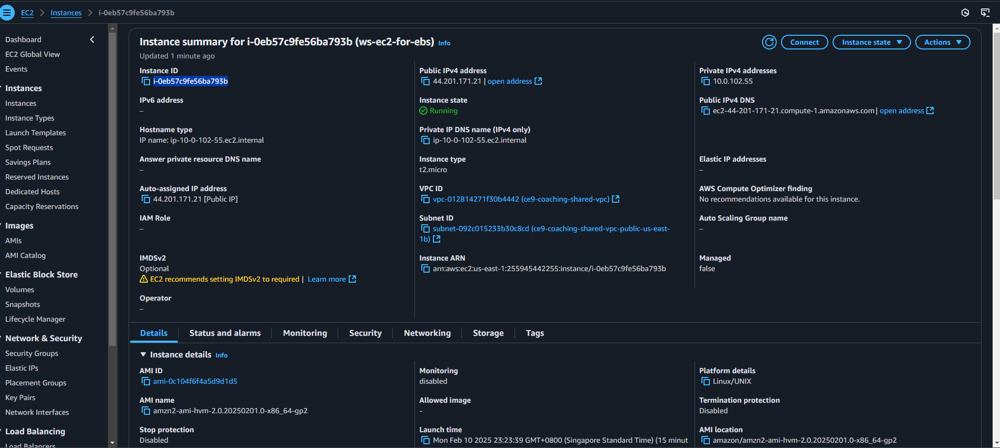
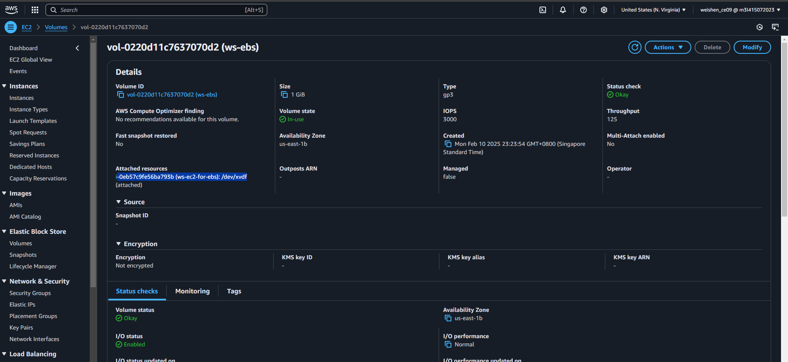
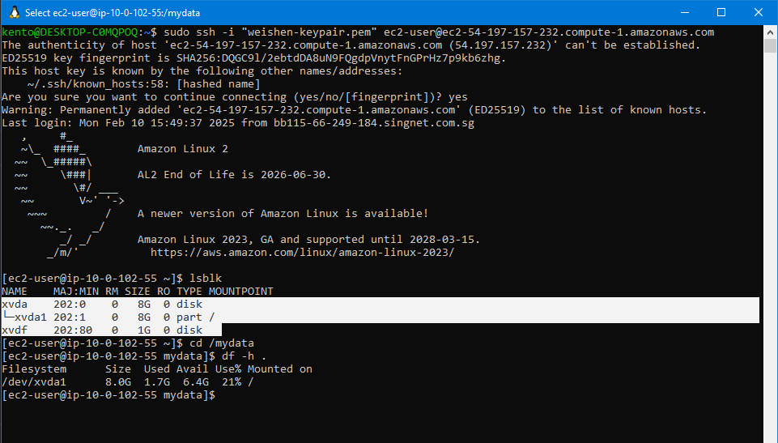

# EBS-to-EC2
Attach a 1 GB EBS volume onto a EC2 instance.

The EBS volume must be in the same AZ as your EC2’s subnet. 

Don’t have to format / mount the EBS volume

Outcome:
# Verify EC2 created in AWS Console:

# Verify EBS Volume attached to EC2
Terminal:

AWS Console:
EBS ID: 
EC2 ID: 

# SSH Into Ec2 
cd into “mydata” directory and check the disk space to validate the volume mount.

Run command:
cd /mydata
df -h .

